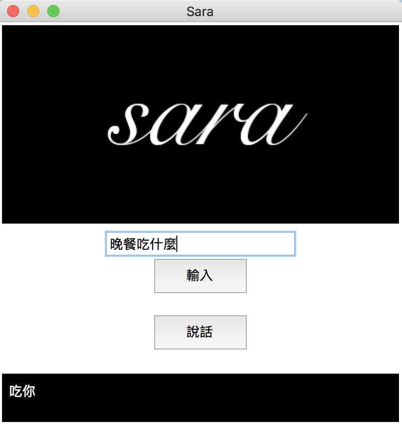
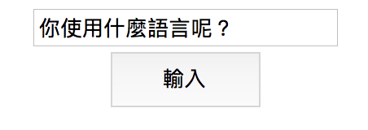
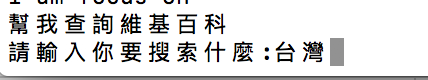
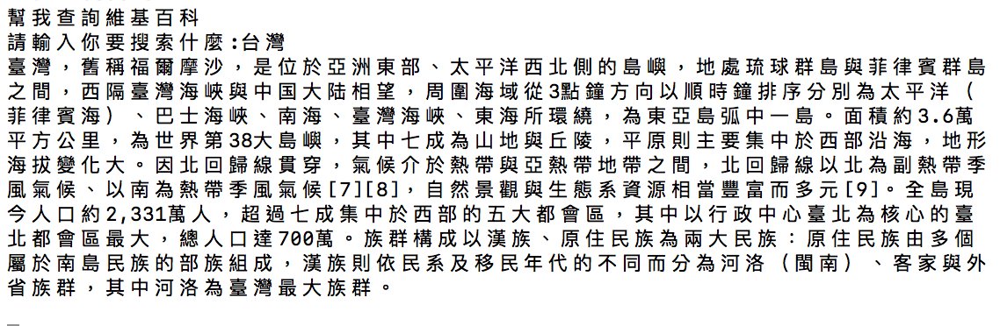
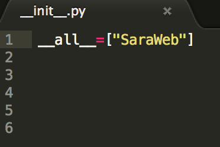
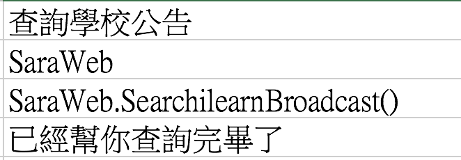

# Sara
個人語音助理

 使用方法:
=
1.需安裝python環境(python3)

2.於目錄下執行python3 Sara.py即可 

3.可以從文字輸入區域輸入指令or要對Sara說的話  

4.Sara會自動依照他的ai去做回應 如果有相關指令可能會需要使用者輸入資訊 無指令的話會依照ai去回應你
(通常都是亂喇賽)

Ex我請Sara幫我查詢維基百科 Sara收到指令後會詢問你要查詢什麼 

於小黑窗or小白窗輸入

Sara獲得的結果會顯示在這 

目前功能(指令):
=
時間,爬取學校最新公告(逢甲ilearn),台中天氣,維基百科...

如何參與開發Sara功能:
=
我們已經定義好與Sara的接口(SaraModules,Sara指令表)

1.直接撰寫module
==

可先參考
>SaraModules
>>__SaraWeb.py__

是一個製作好的範例模組是Sara與網頁有關的功能模組 ex爬蟲 (陸續增加中)

撰寫好後將檔案放入SaraModules下資料夾下,並將模組名稱加入
>SaraModules
>>__init.py__

打開init.py會看到

請將你的模組名稱加入進來(參考"SaraWeb") Sara就會在執行時Import你的模組

2.將你的指令加入指令表
==

>Sara指令表
>>__Sara指令表__.xml

是一個excel檔裡面放置了Sara聽到什麼關鍵指令要去執行你的模組功                        能 

EX: 以查詢學校公佈欄這項功能為例
>SaraModules
>>__SaraWeb.py__

裡面有一個Function為__SearchilearnBroadcast()__即是讓Sara爬取學校網站公佈欄的功能實作完之後我需要讓Sara知道我聽到什麼指令要去執行於是我需要編輯__Sara指令表.xml__

指令表格式依序為 

關鍵字

模組名稱

函式

Callback (Sara執行完後會說的話）

對應:

將指令輸入後即可成功擴充Sara的功能啦!
              
